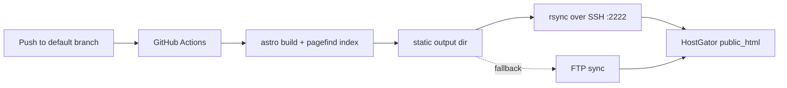

# Static Blog Platform

## Context

`buildando.com` is today a WordPress blog: Portuguese, focused on software craftsmanship and object-oriented best practices, authored by Fernando Teixeira, hosted on HostGator shared hosting. The anchor post is "Object Calisthenics".

This project replaces that WordPress installation with a statically generated blog. The name **Buildando** and the domain `buildando.com` are kept — the existing name carries whatever SEO authority the domain already has — while the logo, visual design, and the entire technology stack change.

Two audiences are served at once, and this shapes every decision below:

1. **The author**, who wants publishing a post to be as cheap as dropping a folder of markdown and images into the repository.
2. **Forkers**, other people who want their own blog. Everything Buildando-specific shall live in one configuration surface so that a fork is a config edit and a logo swap, never a code rewrite.

The stack is **Astro**. It emits static HTML with zero client JavaScript by default, which is the property that most directly serves SEO and Core Web Vitals; its content collections model a per-post folder of markdown plus colocated assets natively; and its islands architecture lets the one interactive piece — the GitHub Discussions embed — load only on the pages that need it. These map onto the requirements below without fighting the framework.

The blog has **no backend**. Everything the reader needs — pages, search, feeds, structured data — is produced at build time and served as static files. The two features that would normally imply a server, full-text search and discussions, are handled without one: search by a build-time static index (Pagefind), discussions by delegating to GitHub Discussions through the giscus embed.

Hosting stays on HostGator. HostGator has no official CLI; a static site is published to `public_html` over SSH/rsync (SSH is on port `2222` and must be enabled for the plan through support) or, failing that, over FTP. Deployment is automated from GitHub Actions.

Reference facts, to be re-verified at implementation time before pinning:

- Astro is the static site generator; content collections with a Zod schema validate frontmatter at build.
- `@astrojs/rss` and `@astrojs/sitemap` are the official RSS and sitemap integrations.
- Pagefind is a static, build-time full-text search library designed for exactly this: it indexes the built HTML and ships a small client that needs no server.
- giscus embeds a GitHub Discussions thread; it requires the backing repository to be **public**, to have **Discussions enabled**, and to have the **giscus GitHub App** installed, and it reads its `repoId` and `categoryId` from the giscus configurator.
- HostGator SSH is port `2222`, disabled by default on shared plans, enabled via support.

## Problem

Publishing on WordPress means a database, a login, an admin UI, a plugin surface, and a server that must be patched. For a personal technical blog that is mostly prose and code, this is cost without matching benefit: the content is text under version control's natural home, and the reader is served faster by a file than by a rendered query.

The author's friction is the target. A new post should not require touching layout, configuration, navigation, or a build script — only adding content. If adding a post ever forces a code change, the model has failed.

The forker's friction is the second target. A template that hardcodes one person's name, colors, analytics, and repository across a dozen files is not forkable in practice; it is a project you must read in full before you can rename. Everything identity-bearing shall be funneled into a single configuration surface.

Search and discussion are the two features that tempt a backend. Both are refused a server: search is precomputed into a static index at build, and discussion is delegated to GitHub, which already hosts an identity system, moderation, and storage the blog would otherwise have to build. The blog embeds the conversation; it does not own it.

SEO is not an afterthought bolted on at the end; it is a set of build outputs — per-page metadata, structured data, a sitemap, a feed, canonical URLs, and a fast, mostly-JS-free page — that the platform shall produce for every post automatically, so that appearing in Google is a property of publishing rather than a manual checklist.

## Goals

- Replace WordPress with a statically generated Astro blog served from HostGator, keeping the `buildando.com` name and domain.
- Make publishing a post a content-only action: add one folder of markdown, images, and frontmatter; change no code and no config.
- Validate every post's frontmatter at build time and fail the build on malformed content rather than shipping it broken.
- Render markdown to HTML that inherits the site's typography and CSS, with no per-post styling required.
- Produce complete SEO output for every page automatically: title, description, canonical, Open Graph, Twitter Card, JSON-LD, sitemap, robots, and RSS.
- Provide faceted navigation by tag and category, and full-text search, entirely client-side with no backend.
- Embed each post's GitHub Discussions thread through giscus.
- Keep all brand, design, and integration identity in one configuration surface, so a fork is a config edit plus a logo swap.
- Deploy automatically from GitHub Actions to HostGator `public_html`, with no secret committed to the repository.

## Non-Goals

- Migrate the existing WordPress posts. The blog starts with no real content; it ships exactly one clearly-marked example post that exercises the full structure and serves as the living template. Migration of the old posts and any redirects from their WordPress URLs are deferred to a later spec.
- Provide a server, database, admin UI, or authenticated authoring flow.
- Build a comment system. Discussion is delegated to GitHub Discussions via giscus and is not reimplemented.
- Build a server-side or hosted search service. Search is a build-time static index only.
- Design the final visual identity (logo, palette, type scale). The platform exposes these as configurable theme parameters; the actual visual design is a separate, later effort. This spec guarantees the parameters exist and are honored, not what their values are.
- Configure HostGator itself (enabling SSH, DNS, TLS). The spec states the deployment contract the platform targets; performing the account changes is an operational task, tracked in Risks.
- Pin exact dependency versions. Versions are verified and pinned at implementation time; this spec names tools, not versions.

## Requirements

### Content authoring

- `REQ-001`: A post shall be a single directory under the posts content root, containing a markdown entry file and any images it references colocated in that same directory.
- `REQ-002`: Adding a post shall require adding exactly one such directory and shall require no change to any layout, component, configuration, route, or build script.
- `REQ-003`: Post frontmatter shall be validated against a declared schema at build time, and the build shall fail with a clear error identifying the post and the field when a required field is missing or a field has the wrong type.
- `REQ-004`: The frontmatter schema shall require `title`, `description`, and `publishDate`, and shall accept optional `updatedDate`, `tags`, `category`, `cover`, `author`, `draft`, `keywords`, `ogImage`, `canonicalURL`, and a discussion mapping override.
- `REQ-005`: Markdown body content shall be rendered to HTML that inherits the site's global typography and CSS, such that a post needs no styling of its own to match the site.
- `REQ-006`: Images colocated in a post directory and referenced from its markdown shall be processed at build into optimized, responsive, lazily-loaded output, without the author configuring image handling per post.
- `REQ-007`: A post marked `draft: true` shall be excluded from the production build's pages, listings, facet pages, sitemap, RSS, and search index, and shall remain visible in local development.

### Static structure and theming

- `REQ-008`: Page structure — layouts, header, navigation, footer — shall be defined once, statically, and shall be separate from post content.
- `REQ-009`: All identity-bearing parameters — site name, description, canonical domain, logo asset reference, color and typography tokens, author identity, social links, navigation entries, and integration identifiers — shall be declared in a single configuration surface, such that forking requires editing that surface and replacing the logo asset, and nothing else.
- `REQ-010`: The build output shall be fully static HTML, CSS, and client assets, requiring no application server and deployable to any static host.
- `REQ-030`: No identity-bearing value — the string "buildando", the author's name, the domain, the discussions repository, analytics identifiers — shall appear anywhere outside the single configuration surface of `REQ-009`.

### Theme and internationalization

- `REQ-031`: The site shall support a light and a dark color theme. The configured default theme shall be what a first-time visitor sees; a reader shall be able to switch themes from a control in the header, the choice shall be remembered across visits, and the switch shall not cause a flash of the wrong theme on load. A fork shall be able to lock the site to a single theme and hide the control from the configuration surface.
- `REQ-032`: The site shall support multiple content languages. Each configured locale shall have its own URL prefix, its own listings, facets, feed, and its own translation of the interface strings; a reader shall be able to switch language from the header; a post shall declare its language and may link its translations; and each page shall emit correct `<html lang>`, `og:locale`, and `hreflang` alternates. Adding or removing a locale shall be a change to the configuration surface and the string dictionary, not to page code.
- `REQ-034`: The top of the home page shall be authored as free-form markdown, one entry per locale, rendered with the site's styles. When a locale has no home entry, the home shall fall back to the site name and localized description. The entry may optionally override the home page's SEO title and description; it shall not require any code change to edit.
- `REQ-033`: On a post page, switching language shall navigate to the same post's translation in the chosen language when one exists. When no translation exists, the reader shall remain on the same post content, but the entire page chrome — navigation, footer, section headings, date formatting, and the comments UI — shall render in the chosen language. On such a fallback page, `<html lang>` shall be the chosen page locale, the article body shall carry its own content language, and the page's canonical shall point at the post's own-language URL so the near-duplicate body is not indexed twice. The page locale shall therefore be independent of the post's content language.

### SEO

- `REQ-011`: Every page shall emit a `<title>`, a meta description, and a canonical URL.
- `REQ-012`: Every post page shall emit Open Graph and Twitter Card metadata, using the post's cover image as the preview image when one is present and a configured site default otherwise.
- `REQ-013`: Every post page shall emit JSON-LD structured data describing the article, and the site shall emit `WebSite` and breadcrumb structured data where applicable.
- `REQ-014`: The build shall generate `sitemap.xml` automatically from the published pages, excluding drafts.
- `REQ-015`: The build shall generate `robots.txt` that references the sitemap.
- `REQ-016`: The build shall generate an RSS feed of published posts.
- `REQ-017`: Content pages shall use semantic, accessible HTML and shall ship no client JavaScript beyond what an explicitly interactive island requires, so that a post page is fast by construction.
- `REQ-018`: The canonical domain shall be read from the configuration surface, and every absolute URL in SEO output — canonical, Open Graph, sitemap, RSS — shall be derived from it.

### Facets and search

- `REQ-019`: `tags` and `category` shall be treated as facets, and the build shall generate a listing page for each distinct tag and each distinct category, linking the posts that carry it.
- `REQ-020`: The site shall provide full-text search across all published posts, executed entirely on the client with no backend request to any server the platform owns.
- `REQ-021`: The search index shall be produced automatically at build time from the rendered post content, with no manual index maintenance.
- `REQ-035`: The home page shall let the reader filter the displayed post list interactively by facets — category and tag as toggle chips, and publication date as an inclusive `from`/`to` range chosen with month and year selectors whose month names are localized to the page language — on the client, without a full page navigation and with no backend. Filters shall combine as AND across facets and OR within a facet. The active filter shall be encoded in the URL query string so a filtered view is shareable and survives reload and the back button. When a facet has many values, its chips shall collapse to a fixed number behind a "show more"/"show less" control, always keeping any active chip visible. The filtering shall be additive to the existing per-facet listing pages (`REQ-019`), not a replacement, and shall degrade to the full list when JavaScript is unavailable, with the filter controls (and the collapsing) inert in that case so every chip and the full list remain.
- `REQ-037`: Listings — the home, tag pages, and category pages — shall support static pagination governed by a configurable page size. When the page size is zero, every post appears on one page and the home facet filter (`REQ-035`) is available. When it is positive and a listing exceeds it, the listing shall be split into pre-rendered, independently crawlable numbered pages with previous/next navigation and `rel="prev"`/`rel="next"` hints; at that scale faceted browsing is served by the per-facet pages (`REQ-019`) and search (`REQ-020`), and the home facet filter is not shown. Pagination shall require no backend and no client JavaScript. The facet filter shall appear whenever a listing fits on a single page, regardless of the configured size.
- `REQ-036`: Search shall be reachable from the site layout on every page — not only from the dedicated `/search` page — through a header control that opens a modal, also openable by the `/` key and by Ctrl/Cmd+K, and closable by Escape or backdrop click. It shall reuse the client-side, backend-free index of `REQ-020`, loaded lazily on first open. Without JavaScript, the header control shall be a plain link to `/search`.

### Discussions

- `REQ-022`: Each post page shall embed that post's GitHub Discussions thread through giscus.
- `REQ-023`: The giscus integration — repository, repository id, category, category id, and mapping strategy — shall be configured once in the configuration surface and not repeated per post.
- `REQ-024`: The mapping from a post to its discussion thread shall be deterministic, so that the same post always resolves to the same thread, with a per-post frontmatter override available for exceptions.

### Deployment

- `REQ-025`: A GitHub Actions workflow shall build the site and deploy the build output to HostGator `public_html` on push to the default branch.
- `REQ-026`: Deployment shall transfer only the build output, shall authenticate using credentials held in GitHub Actions secrets, and shall place no secret — SSH key, password, host — in the repository.
- `REQ-027`: The primary deployment path shall be rsync over SSH on port `2222`; an FTP-based fallback shall be documented for plans without SSH.
- `REQ-028`: The site shall build and be previewable locally with a single documented command each, producing output identical in shape to what the workflow deploys.

### Forkability

- `REQ-029`: The repository shall document the fork procedure, and shall ship exactly one example post that exercises every structural feature — frontmatter fields, colocated images, tags, category, cover, and the discussion embed — so that it doubles as the authoring template.

## Acceptance Criteria

- Given a new post directory with valid frontmatter and a colocated image, when the site is built, then the post appears in the home listing, its tag and category facet pages, the sitemap, the RSS feed, and the search index, with no other file changed.
- Given a post whose frontmatter omits `title`, when the site is built, then the build fails and the error names the offending post and the missing field.
- Given a post with `draft: true`, when the production site is built, then the post appears in neither any page, listing, facet, sitemap, feed, nor search index; and when the dev server runs, then the post is reachable.
- Given a post with a colocated cover image, when its page is rendered, then the Open Graph and Twitter image tags reference that image as an absolute URL under the configured domain.
- Given any post page, when its HTML is inspected, then it carries a canonical URL, a meta description, Open Graph tags, Twitter Card tags, and JSON-LD `BlogPosting` structured data.
- Given the built output, when it is inspected, then `sitemap.xml`, `robots.txt`, and an RSS feed exist, the sitemap and feed list only published posts, and `robots.txt` points at the sitemap.
- Given a post page in a production build, when its network activity is measured, then no JavaScript loads until the reader interacts with the search or the discussion embed.
- Given a reader typing a query into search, when results appear, then they were computed on the client from a build-time index, with no request to a platform-owned backend.
- Given a post page, when it is scrolled to the discussion section, then it shows the GitHub Discussions thread for that post via giscus, resolved by the configured deterministic mapping.
- Given a forker who edits only the configuration surface and replaces the logo asset, when they build, then the site carries their name, domain, colors, social links, navigation, and discussion repository, with no Buildando identity remaining.
- Given the configured default theme, when a first-time visitor loads any page, then it renders in that theme with no flash; and when they use the header toggle, then the theme switches and is still applied after a reload.
- Given two configured locales, when the site is built, then each locale has its own prefixed home, listings, facets, and feed, the root redirects to the default locale, every page carries the right `<html lang>` and `hreflang` alternates, and the header offers a language switch.
- Given a post that has a translation in the other locale, when the reader switches language on that post, then they land on the translated post.
- Given a post that has no translation in the other locale, when the reader switches language on that post, then the URL stays on that post's content but the whole page chrome renders in the chosen language, `<html lang>` is the chosen locale, the article body is marked with the post's own language, and the canonical points at the post's own-language URL.
- Given the home with facet controls, when the reader toggles a category or tag chip or sets a date bound, then the post list narrows on the client, the URL query string reflects the active filter, and reloading or sharing that URL reproduces the same filtered view; and with JavaScript disabled, the controls are hidden and the full list shows.
- Given any page, when the reader presses `/` or Ctrl/Cmd+K or clicks the header search control, then a search modal opens over the page and queries the client-side index; and with JavaScript disabled, the control links to `/search`.
- Given a push to the default branch, when the workflow runs, then it builds the site and deploys the output to `public_html`, using only secrets stored in GitHub Actions, with nothing sensitive read from the repository.

## Domain Rules

The domain here is small and editorial rather than transactional; the rules govern the shape of content, not a business process.

- A **post** is one directory. Its identity — its slug, and therefore its URL — is its directory name. Renaming the directory changes the URL; this is the author's deliberate act, not an incidental one.
- A post has exactly one markdown entry file. Everything else in the directory — images, and any other assets — is subordinate to it and referenced from it.
- **Required** metadata is `title`, `description`, and `publishDate`. These are the fields with no safe default: a title cannot be invented, a description drives search snippets and social previews and must be authored, and a publish date orders the archive and stamps the feed. A post missing any of them is not publishable, and the build says so rather than guessing.
- **Optional** metadata carries safe fallbacks. `updatedDate` defaults to unset. `tags` and `category` default to empty, in which case the post simply appears on no facet page. `cover` absent means SEO images fall back to the site default. `author` absent means the configured site author. `draft` absent means `false`. `canonicalURL` absent means the post's own URL. The discussion override absent means the configured default mapping.
- A **draft** is content that exists in the repository but not in production. The dividing line is the production build: drafts cross into development and stop at the production boundary. This lets a post be written, committed, and previewed before it is public, without a separate branch.
- **Facets** are `tags` and `category`. A facet value is discovered, not declared: the set of tag pages is exactly the set of tag values that appear across published posts. There is no registry of allowed tags to keep in sync; adding a tag to a post's frontmatter creates its facet page if it did not exist and removes it when the last post carrying it is unpublished.
- The **discussion thread** for a post is derived deterministically from the post, so it is stable across rebuilds and rebrandings of the page. The default derivation is owned by the configuration; a post may override it in frontmatter when, for example, a thread already exists under a different key.
- **Identity is configuration, not content.** The name "Buildando", the domain, the author, the colors, and the discussions repository are parameters. A post never names them; it inherits them. This is the rule that makes the fork cheap and is enforced structurally by `REQ-030`.

## Interfaces and Contracts

### Post Directory Convention

A post is a directory under the posts content root. The markdown entry file and its images live together:

```text
src/content/posts/
  object-calisthenics/
    index.md          # markdown body + frontmatter
    cover.jpg         # colocated, referenced relatively from index.md
    diagram.png
```

The directory name is the slug and the last URL segment. Authoring a post is creating one such directory; nothing outside it changes (`REQ-002`).

### Frontmatter Schema

The schema is declared once, in the content collection configuration, and enforced at build (`REQ-003`). Field intent:

| Field | Required | Type | Meaning |
| --- | --- | --- | --- |
| `title` | yes | string | Post title; drives `<h1>`, `<title>`, and structured data. |
| `description` | yes | string | Meta description, search snippet, and social preview text. |
| `publishDate` | yes | date | Publication date; orders listings and stamps the feed. |
| `updatedDate` | no | date | Last substantive update; surfaced in structured data. |
| `tags` | no | string[] | Facet values; each generates or joins a tag page. |
| `category` | no | string | Single facet value; generates or joins a category page. |
| `cover` | no | image | Colocated cover image; hero and default social image. |
| `author` | no | string | Overrides the configured site author. |
| `draft` | no | boolean | `true` withholds the post from production. Default `false`. |
| `keywords` | no | string[] | Optional SEO keywords. |
| `ogImage` | no | image/string | Overrides the social preview image. |
| `canonicalURL` | no | string | Overrides the canonical URL for cross-posted content. |
| `discussion` | no | string | Overrides the giscus mapping term for this post. |

The schema is the contract between the author and the platform. It is deliberately small: three required fields, and every optional field has a defined fallback (see Domain Rules). A field the schema does not know is a build error, not silent data, so a typo in a field name is caught rather than ignored.

### Configuration Surface

One configuration surface holds every identity-bearing and integration parameter (`REQ-009`, `REQ-030`). It is the only file a forker must edit, plus the logo asset it points at. It carries at least:

```text
site:        name, description, canonical domain (URL), default author, default social image
brand:       logo asset path, color tokens, typography tokens
social:      profile links (Twitter/X, GitHub, YouTube, ...)
nav:         header navigation entries
giscus:      repo, repoId, category, categoryId, mapping, theme
seo:         default OG image, locale/language
analytics:   optional privacy-friendly analytics id (empty disables it)
```

The contract is negative as much as positive: no other file may read a HostGator, Buildando, author, or repository identity. Where a component needs the site name or domain, it imports it from here. This is what `REQ-030` asserts and what an architecture test should guard.

### Deployment Contract

The workflow builds on push to the default branch and transfers only the build output to `public_html` (`REQ-025`, `REQ-026`):

| Concern | Contract |
| --- | --- |
| Trigger | Push to the default branch. |
| Build | Install, then build; output is a single static directory. |
| Transfer (primary) | rsync over SSH to `public_html`, host on port `2222`. |
| Transfer (fallback) | FTP sync, for plans without SSH (`REQ-027`). |
| Secrets | SSH host, user, and private key (or FTP credentials) in GitHub Actions secrets only. |
| Repository | Contains no host, no credential, no key (`REQ-026`). |
| Server config | An `.htaccess` in the output sets caching, compression, and HTTPS canonicalization; redirects from old WordPress URLs are out of scope here (see Non-Goals). |

SSH on HostGator shared hosting is disabled by default and on port `2222`; enabling it is an operational precondition, recorded in Risks. When SSH cannot be enabled, the FTP fallback path applies without changing the build.

### giscus / GitHub Discussions Contract

The discussion embed delegates entirely to GitHub Discussions (`REQ-022`–`REQ-024`):

- The backing repository shall be public, have Discussions enabled, and have the giscus GitHub App installed.
- `repo`, `repoId`, `category`, and `categoryId` are configured once in the configuration surface, obtained from the giscus configurator.
- The mapping is deterministic — the same post always resolves to the same thread — with a per-post `discussion` frontmatter override for exceptions.
- The embed is an island: its script loads only on post pages and only when its section is reached, so `REQ-017` holds for the rest of the page.

giscus creates the discussion on first visit, so no thread needs to pre-exist for a new post.

### SEO Output Contract

For every post page the platform emits, without author action (`REQ-011`–`REQ-018`):

- `<title>` and meta `description`.
- `<link rel="canonical">`, defaulting to the page URL under the configured domain, overridable via `canonicalURL`.
- Open Graph (`og:title`, `og:description`, `og:image`, `og:type=article`, `og:url`) and Twitter Card tags, image from `cover`/`ogImage` or the site default, as absolute URLs under the configured domain.
- JSON-LD `BlogPosting` with title, description, dates, author, and image; plus site-level `WebSite` and breadcrumb data.

Site-wide, the build emits `sitemap.xml` (drafts excluded), `robots.txt` referencing it, and an RSS feed of published posts.

## Architecture Notes

### Layered Structure

The project separates, by directory, four concerns that change for different reasons:

```text
buildando.com
├── astro.config.mjs           # integrations: sitemap, rss wiring, image, pagefind
├── src/
│   ├── config/                # THE configuration surface (REQ-009, REQ-030)
│   ├── content/
│   │   ├── config.ts          # frontmatter schema (REQ-003, REQ-004)
│   │   └── posts/<slug>/       # content: one directory per post (REQ-001)
│   ├── layouts/               # static page structure (REQ-008)
│   ├── components/            # header, footer, SEO head, post card, giscus island
│   ├── pages/                 # routes: index, post, tag, category, search, feed, robots
│   └── styles/                # global CSS + theme tokens consumed from config
├── public/                    # static passthrough (logo, favicons, .htaccess)
└── .github/workflows/         # deploy workflow (REQ-025)
```

The boundaries are deliberate. Content changes when the author writes; it never forces a code change (`REQ-002`). The configuration surface changes when identity changes; it is the fork seam (`REQ-009`). Layouts and components change when the design changes; they read identity from config and never hardcode it (`REQ-030`). This is the same discipline as the hexagonal separation in the sibling projects, applied to a content site: content, identity, and presentation do not leak into each other.

### Why Static, Why Astro

The reader is served a file. There is no render-time query, so there is no server to run, patch, or scale, and the page is as fast as the host can serve bytes. Astro is chosen over a React-based static export because it ships **zero** client JavaScript by default; a content page carries none unless an island opts in. That default is the mechanism behind `REQ-017`, and `REQ-017` is a large part of what makes the blog rank and load well. The two interactive pieces — search and the discussion embed — are islands, so their cost is paid only on interaction and only where present.

### Search Without a Backend

Full-text search normally implies a server holding an index. Pagefind moves the index into the build: it reads the generated HTML, produces a compact static index and a small client, and ships both as static files (`REQ-020`, `REQ-021`). The reader's query runs in the browser against files served from the same static host. There is no platform-owned backend, no API key, and no per-search cost, which is exactly the constraint the blog set itself. Facet navigation by tag and category (`REQ-019`) is separate and simpler: those are generated pages, not search, and they work with JavaScript disabled.

### Discussion Without a Backend

The comment system the blog does not build is GitHub's. giscus renders a GitHub Discussions thread inside an island (`REQ-022`). GitHub owns identity, moderation, storage, and notification; the blog owns only the embed and the deterministic mapping to a thread (`REQ-024`). This trades a self-hosted comment database for a dependency on GitHub and a requirement that readers have a GitHub account to comment — an acceptable trade for a developer-audience blog, recorded in Risks.

### Deployment Pipeline



The workflow is the only thing that touches HostGator. It holds the host, user, and key in GitHub Actions secrets and transfers only the built directory (`REQ-026`). rsync sends only changed files, which keeps deploys cheap on shared hosting; FTP is the fallback for a plan where SSH cannot be enabled (`REQ-027`). An `.htaccess` shipped in the output configures compression, caching, and HTTPS canonicalization at the Apache layer HostGator runs.

## Data and Persistence

The platform persists nothing at runtime. All state is either in the repository (content, configuration) or in GitHub Discussions (comments, owned by GitHub). There is no database, no session, and no server-side storage. The "data" of the system is the content directory tree, and its store is git.

## Observability

There is no running service to observe. The signals are:

- **Build**: the CI build log is the primary signal. A malformed post fails the build loudly (`REQ-003`), so broken content is observed before it ships, not after.
- **Deploy**: the workflow's rsync/FTP step reports what it transferred; a failed transfer fails the workflow.
- **Production**: optional privacy-friendly analytics, disabled by default and enabled only by setting an id in the configuration surface, provides traffic signal without a backend. Google Search Console is the external SEO signal and is an operational setup step, not a build output.

## Risks and Open Questions

- **SSH must be enabled on the HostGator plan.** It is off by default on shared hosting and lives on port `2222`, enabled only through support. Until it is, the primary rsync deploy path cannot run and the FTP fallback (`REQ-027`) is the path. This is an operational precondition, not a code task, and it blocks first deploy rather than development.
- **HostGator has no official CLI.** "Install a CLI for HostGator" has no real target; there is no first-party tool. What exists is SSH/rsync and FTP, both standard and both used here. The automation lives in the GitHub Actions workflow, not in a vendor CLI. This resolves the original request rather than leaving it open: the CLI does not exist, so the workflow is the answer.
- **giscus requires a public repository with Discussions enabled and the giscus App installed.** If the blog's source is private, either a separate public repository backs discussions or the discussion feature cannot be used as specified. The repository choice is a precondition for `REQ-022`.
- **giscus requires readers to have a GitHub account to comment.** For a developer-audience blog this is largely acceptable and is the price of not running a comment backend. It does exclude non-GitHub readers from commenting, which a general-audience blog might not accept.
- **Pagefind is the assumed search library but is one of several static options** (Lunr, a prebuilt Fuse.js index, Algolia's free tier). Pagefind is chosen because it scales to many posts without shipping the whole index to every visitor and needs no external service. The choice should be re-confirmed at implementation; the requirement (`REQ-020`, `REQ-021`) is backend-free client search, not Pagefind specifically.
- **The visual design is unspecified by intent.** The platform guarantees theme parameters exist and are honored (`REQ-009`); their values — the actual logo, palette, and type — are a later design effort. A build with placeholder theme values is expected and correct at this stage; it is not a finished look.
- **Internationalization is now in scope (`REQ-032`), reversing the original non-goal.** The platform is multi-locale: every locale is URL-prefixed (`/pt/`, `/en/`), the root redirects to the default, and the interface strings are translated through a dictionary. Two consequences are accepted. First, the default locale's home is `/{lang}/`, not `/`, which is a URL-shape choice a fork can change by moving to un-prefixed default routing; it is prefixed here because a uniform `[lang]/...` tree is simpler to reason about and fork. Second, cross-language post linking is manual: a post lists its translations by slug in frontmatter, and nothing checks that the reverse link exists or that the translations truly correspond — a stale or missing entry produces a wrong or absent `hreflang`, caught only by review.
- **Per-locale content is the author's responsibility.** A locale with no posts renders an empty home rather than falling back to another language's content; that is deliberate, but it means adding a locale to the config without writing posts for it ships an empty section. The exception is the post fallback of `REQ-033`: a post with no translation is still reachable under every locale, with its chrome translated.
- **Fallback post pages are near-duplicate content, and the canonical is the mitigation.** A post with no translation is served under every locale (same body, different chrome). Their canonical points at the post's own-language URL, so search engines consolidate them and only the source ranks; the localized-chrome copies exist for reader navigation, not for indexing. `hreflang` alternates list only genuine translations, never fallback pages. If a fork wants a fallback page to rank in its own right, it must translate the post rather than rely on the fallback.
- **Post routes assume slugs are unique across posts.** A fallback route is `/{locale}/posts/{sourceSlug}/`. If two unrelated posts in different languages share a slug and both lack a translation in some locale, they would both claim `/{locale}/posts/{slug}/` and Astro would fail the build on the duplicate. Unique slugs avoid it; the build surfaces it loudly if violated. A stale `translations` entry (pointing at a slug that does not exist) is handled gracefully — it is ignored, and the locale falls back — rather than producing a broken link.
- **WordPress migration and old-URL redirects are deferred.** Starting fresh means the current posts and their URLs are not carried over. If they later are, redirects from the WordPress permalink structure to the new URLs belong in the `.htaccess` and in a migration spec, to preserve the SEO the domain already has. Deferring this is a deliberate, revisitable choice, not an oversight.
- **RSS full-content vs summary is undecided.** A summary feed is lighter and drives clicks; a full-content feed serves readers better. This is a small editorial choice to settle at implementation, defaulting to summary plus a link.
- **On-home faceted filtering (`REQ-035`) — design settled.** Chips for category and tag, a `from`/`to` date range chosen via localized month/year selectors, filter state in the URL query string, AND across facets / OR within, and a per-facet "show more" collapse (12 chips) so many tags do not wall off the posts. Implemented as a progressive-enhancement island over the already-rendered cards: the predicate and URL mapping live in the pure `src/lib/facet-filter.ts` (unit-tested), and the client script toggles card visibility. The controls are hidden and the collapse inert when JS is off, leaving the full static list — so this never fights the per-facet listing pages. The date filter resolves to month granularity (first/last day of the chosen month), which suits a blog; a finer picker or a year/month archive view, if wanted, is a separate addition. The month-name localization comes from `Intl`, which is why native `<input type="date">` was rejected — its widget follows the browser locale, not the page.
- **In-layout search (`REQ-036`) — design settled.** A header magnifier opens a modal (native `<dialog>`), also bound to `/` and Ctrl/Cmd+K, reusing the Pagefind index loaded lazily on first open. Without JS the header control is a plain link to `/search`, which still satisfies `REQ-020`. The modal complements the `/search` page rather than replacing it.
- **`.htaccess` on shared Apache is powerful and fragile.** Caching, compression, and HTTPS rules are easy to get subtly wrong on shared hosting. The shipped `.htaccess` should be minimal and tested against the live host rather than assumed.
- **Spec language is English while the blog is Portuguese.** The spec follows the existing `.specs` convention (English, `shall`) because it is a fork of that established SDD practice and English widens the forkable template's audience. Reader-facing docs (README) may be bilingual. If a Portuguese spec is preferred, that is a cheap change to make now and expensive later.

## Test Strategy

The platform has little runtime logic; most requirements are verified at build time or by inspecting build output. Tests tie back to requirements:

- `REQ-001`, `REQ-002`: Add a post directory in a test fixture and assert the build picks it up and that no other source file is touched.
- `REQ-003`, `REQ-004`: Build with a post missing a required field and assert the build fails naming the post and field; build with a valid post and assert success.
- `REQ-005`: Snapshot a rendered post and assert its body carries the global content styles, not inline per-post styles.
- `REQ-006`: Assert a colocated image referenced from markdown appears in the output as an optimized, responsively-sized asset.
- `REQ-007`: Build in production with a `draft: true` post and assert it is absent from pages, listings, facets, sitemap, RSS, and the search index; run dev and assert it is reachable.
- `REQ-008`, `REQ-009`, `REQ-030`: Grep/architecture test asserting identity strings (site name, domain, discussions repo) appear only in the configuration surface and nowhere else in `src`.
- `REQ-011`–`REQ-013`, `REQ-018`: Parse a built post page and assert presence and correctness of title, description, canonical, Open Graph, Twitter Card, and JSON-LD, with absolute URLs under the configured domain.
- `REQ-014`–`REQ-016`: Assert `sitemap.xml`, `robots.txt`, and the RSS feed exist in output, list only published posts, and that `robots.txt` references the sitemap.
- `REQ-017`: Assert a built post page references no client script tag except the search and discussion islands.
- `REQ-019`: Build fixtures with overlapping tags/categories and assert one page per distinct value listing the right posts.
- `REQ-020`, `REQ-021`: Assert the search index is generated in output and that a known term resolves to the expected post via the client index.
- `REQ-022`–`REQ-024`: Assert the giscus embed is present on a post page, configured from the configuration surface, resolving to the deterministic mapping, and honoring a frontmatter override.
- `REQ-025`–`REQ-028`: Validate the workflow builds and invokes the transfer step with secrets, not repository values; assert local build and preview commands each run in one step and produce the same output shape.
- `REQ-029`: Assert the shipped example post exercises every frontmatter field and colocated-image path, so it is a complete template.

## Implementation Trace

Scaffolded 2026-07-20. Paths are relative to the repository root. Status legend:
**Done** = implemented and verified by inspecting the production build output;
**Done (code)** = implemented but not yet exercised against live infrastructure;
**Test pending** = the automated test named in Test Strategy is not yet written —
the requirement is currently verified by build inspection, not by a committed test.

Cross-cutting note: a **first automated test batch exists** (`test/`, Vitest, 26
tests, run by `npm test` and in CI before deploy):

- `test/i18n.test.ts` — the i18n helpers: translation fallback chain, site
  title/description overrides, `localizedPath`, `langFromUrl`, `hreflangAlternates`.
- `test/post-routes.test.ts` — the translation-vs-fallback routing of `REQ-033`,
  extracted to the pure `src/lib/post-routes.ts`: translated pairs emit two
  canonicals and switch straight across; untranslated posts emit a fallback whose
  canonical points at the source; stale translation links degrade to a fallback;
  hreflang never lists fallback pages.
- `test/facet-filter.test.ts` — the pure home-filter logic of `REQ-035`:
  category/tag/date predicates, AND-across / OR-within, and URL round-tripping.
- `test/build.test.ts` — assertions on `dist/` (root redirect, per-locale
  homes/feeds, post SEO, markdown hero, English tagline, the untranslated-post
  fallback page, the Pagefind index, the home filter bar and card metadata, and
  the search trigger/modal on every page) plus a source scan enforcing `REQ-030`.

Requirements still marked "Test pending" below are covered by build inspection
but not yet by a committed test. The remaining gaps are chiefly draft exclusion
with a fixture, image-optimization assertions, and the architecture rules.

- `REQ-001`: Done. `src/content/config.ts` (`type: "content"`); a post is `src/content/posts/<slug>/index.md` with colocated images, e.g. `.../exemplo-bem-vindo-ao-buildando/`.
- `REQ-002`: Done. The example post was added without touching any layout, route, or config. Test pending (fixture assertion).
- `REQ-003`: Done. Zod schema in `src/content/config.ts`; Astro fails the build naming the entry and field. Test pending.
- `REQ-004`: Done. Required `title`/`description`/`publishDate`; optionals with fallbacks, in `src/content/config.ts`.
- `REQ-005`: Done. `.prose` styles in `src/styles/global.css`, applied in `src/layouts/PostLayout.astro`.
- `REQ-006`: Done. `<Image widths=[...]>` in `PostLayout.astro`/`PostCard.astro`; `dist/_astro` carries a responsive `srcset` and WebP variants of the cover.
- `REQ-007`: Done (code). `getPublishedPosts` in `src/lib/posts.ts` gates on `import.meta.env.PROD`. Test pending (no draft fixture yet).
- `REQ-008`: Done. `src/layouts/`, `src/components/Header.astro`, `Footer.astro`.
- `REQ-009`: Done. `src/config/site.ts` (`SITE`, `BRAND`, `SOCIAL`, `NAV`, `GISCUS`, `ANALYTICS`); tokens injected by `BaseLayout.astro`.
- `REQ-010`: Done. `dist/` is fully static.
- `REQ-011`: Done. `src/components/BaseHead.astro`; verified in `dist` (title, description, canonical).
- `REQ-012`: Done. `BaseHead.astro` + image resolution in `PostLayout.astro`; verified `og:image` is absolute under the domain.
- `REQ-013`: Done. JSON-LD `BlogPosting`/`WebSite` in `BaseHead.astro`; verified in `dist`.
- `REQ-014`: Done. `@astrojs/sitemap`; `dist/sitemap-index.xml`.
- `REQ-015`: Done. `src/pages/robots.txt.ts`; `dist/robots.txt` references the sitemap.
- `REQ-016`: Done. `src/pages/rss.xml.js` + autodiscovery `<link>` in `BaseHead.astro`; `dist/rss.xml`.
- `REQ-017`: Done (code). Astro ships zero JS by default; the giscus embed loads lazily on scroll and the Pagefind UI is an inline island. Test pending (assert no non-island script tags).
- `REQ-018`: Done. `src/lib/seo.ts` `absoluteUrl`; `astro.config.ts` `site` read from `SITE.url`.
- `REQ-019`: Done. `src/pages/tags/[tag].astro`, `src/pages/categories/[category].astro`, discovery in `src/lib/posts.ts`.
- `REQ-020`: Done. `src/components/Search.astro` + Pagefind; `dist/pagefind/` present.
- `REQ-021`: Done. `build` script runs `pagefind --site dist`.
- `REQ-022`: Done (code). `src/components/Giscus.astro` in `PostLayout.astro`; renders a visible TODO until `GISCUS` ids are filled. Live embed pending real repo ids.
- `REQ-023`: Done. `GISCUS` in `src/config/site.ts`.
- `REQ-024`: Done. `data-mapping="pathname"` with a `data-term` override driven by the post's `discussion` frontmatter.
- `REQ-025`: Done (code). `.github/workflows/deploy.yml`. Live run pending secrets + enabled SSH.
- `REQ-026`: Done (code). Workflow reads only Actions secrets; `.gitignore` excludes keys/`.env`. Live verification pending.
- `REQ-027`: Done. rsync-over-SSH:2222 in the workflow; FTP fallback documented in `README.md`.
- `REQ-028`: Done. `npm run build` and `npm run dev`/`preview` in `package.json`; build verified, dev server verified serving HTTP 200.
- `REQ-029`: Done. `README.md` fork procedure; example post exercises frontmatter, colocated cover, tags, category, and the discussion embed.
- `REQ-030`: Done (code). Identity confined to `src/config/site.ts` by construction. Test pending (grep/architecture assertion that no identity string appears elsewhere in `src`).
- `REQ-031`: Done. `THEME` in `src/config/site.ts`; light/dark tokens and Shiki activation injected by `src/layouts/BaseLayout.astro`; header toggle + no-flash inline script in `src/components/Header.astro`. Verified: toggle and no-flash script present in `dist`, `data-theme` overrides emitted. Test pending.
- `REQ-032`: Done. `I18N` in `src/config/site.ts`; Astro `i18n` + root redirect in `astro.config.ts`; string dictionary in `src/i18n/ui.ts` with helpers in `src/i18n/index.ts`; `lang`/`translations` in `src/content/config.ts`; locale-aware routes under `src/pages/[lang]/`; per-locale RSS. The site title and description are localizable too: `SITE.title`/`SITE.description` are the default-locale values, and other locales override them with `site.title`/`site.description` keys in `src/i18n/ui.ts`, consumed via `siteTitle`/`siteDescription` in the home hero, meta description, Open Graph, RSS, and the `WebSite` JSON-LD. Verified in `dist`: root → `/pt/`, per-locale homes/feeds, localized tagline/title/description on the English home, `hreflang` (pt-BR/en/x-default), correct `<html lang>`, language switcher, both locales in the sitemap. Test pending.
- `REQ-033`: Done. `getPostRoutes` in `src/lib/posts.ts` emits each post's canonical route plus a fallback route per untranslated locale, and computes the header switcher targets and hreflang. `src/layouts/PostLayout.astro` splits page locale (`uiLang`, all chrome) from content language (`<article lang>`, tag/category links) and sets the fallback canonical to the source post; `src/components/Header.astro` honors the per-post `langSwitch`. Verified in `dist` with a translated post (switch lands on the translation) and a Portuguese-only post (switch keeps the post, English chrome, `<html lang="en">`, `<article lang="pt-BR">`, canonical → the `/pt/` source). Test pending.
- `REQ-034`: Done. `home` collection in `src/content/config.ts`; per-locale entries `src/content/home/{pt,en}.md`; rendered in the hero by `src/pages/[lang]/index.astro` with a fallback to name + localized description. Verified in `dist`: both home heroes render from markdown (heading ids present). Test pending.
- `REQ-035`: Done. Pure logic in `src/lib/facet-filter.ts` (predicate + URL mapping, unit-tested in `test/facet-filter.test.ts`); chips, localized `Intl` month/year selectors, the per-facet "show more" collapse, and the enhancement island in `src/pages/[lang]/index.astro`; card metadata (`data-category/tags/date`) in `src/components/PostCard.astro`. Verified in `dist`: filter bar `hidden` for no-JS, category/tag chips, localized month names (Janeiro/July…), month/year selects, "show more" markup, cards carry metadata. Visually stress-tested at 14 categories / 48 tags.
- `REQ-037`: Done. `POSTS_PER_PAGE` in `src/config/site.ts`; Astro `paginate` in the listing routes, now `src/pages/[lang]/[...page].astro`, `.../tags/[tag]/[...page].astro`, `.../categories/[category]/[...page].astro`; `src/components/Pagination.astro` (prev/next, `rel` hints, localized status). The facet filter shows only when a listing fits one page (`page.lastPage === 1`); the hero renders on page 1 only. Verified with the default `0` (one page, filter present, no pagination) and, with a temporary size of 1, two crawlable pages (`/pt/2/`), the pagination nav, `rel="prev"/"next"`, the filter hidden, and paginated tag pages.
- `REQ-036`: Done. `src/components/SearchModal.astro` (native `<dialog>`, lazy Pagefind, `/` and Ctrl/Cmd+K), mounted once in `src/layouts/BaseLayout.astro`; header trigger in `src/components/Header.astro` degrading to a `/search` link. Verified in `dist`: trigger + dialog on every page. `/search` still covers `REQ-020`.

### Verification performed

Scaffolded and built on 2026-07-20 with Astro 5 on Node 24. `npm run build`
produced 10 pages plus `sitemap-index.xml`, `robots.txt`, `rss.xml`, and a
Pagefind index under `dist/pagefind/`. Inspection of a built post page confirmed
title, meta description, canonical, the full Open Graph and Twitter Card sets
with an absolute `og:image`, and JSON-LD `BlogPosting`. The colocated cover was
emitted as a responsive `srcset` with WebP variants. Fonts are self-hosted
(Fontsource, bundled into `dist/_astro`), with no external font request. The dev
server served the home page with HTTP 200.

Not verified: a live deploy to HostGator (needs SSH enabled and Actions secrets),
the live giscus embed (needs a public repo with Discussions and real ids), and
the automated test suite in Test Strategy, which is not yet written.
